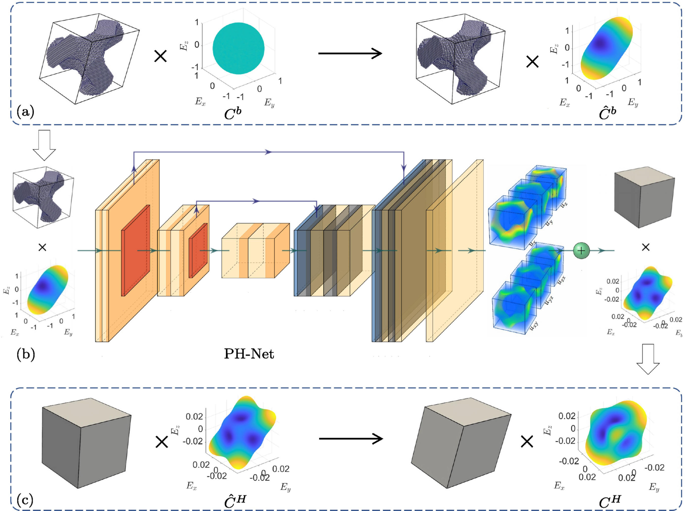
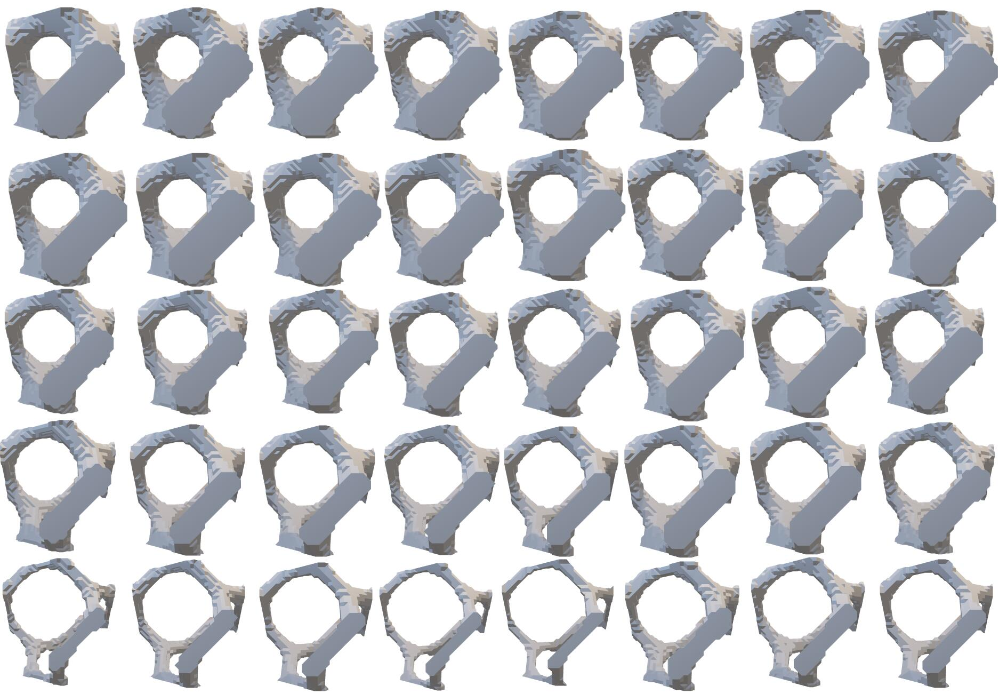

# PH-NET
[In Chinese](Readme_zh.md)

This repository contains the code to reproduce the results from the paper
[PH-Net: Parallelepiped Microstructure Homogenization via 3D Convolutional Neural Networks](https://doi.org/10.1016/j.addma.2022.103237).

You can find detailed usage instructions for training your own models and using pretrained models below.

If you find our code or paper useful, please consider citing

    @article{peng2022ph,
        title={PH-Net: Parallelepiped microstructure homogenization via 3D Convolutional Neural Networks},
        author={Peng, Hao and Liu, An and Huang, Jingcheng and Cao, Lingxin and Liu, Jikai and Lu, Lin},
        journal={Additive Manufacturing},
        volume={60},
        pages={103237},
        year={2022},
        publisher={Elsevier}
    }

## Abstract
Microstructures are attracting academic and industrial interest because of the rapid development of additive manufacturing. The numerical homogenization method has been well studied for analyzing mechanical behaviors of microstructures; however, it is too time-consuming to be applied to online computing or applications requiring high-frequency calling, e.g., topology optimization. Data-driven homogenization methods are considered a more efficient choice but the microstructures are limited to cubic shapes, therefore are unsuitable for periodic microstructures with a more general shape, e.g., parallelepipeds. This paper introduces a fine-designed 3D convolutional neural network (CNN) for fast homogenization of parallelepiped microstructures, named PH-Net. Superior to existing data-driven methods, PH-Net predicts the local displacements of microstructures under specified macroscopic strains instead of direct homogeneous material, empowering us to present a label-free loss function based on minimal potential energy. For dataset construction, we introduce a shape–material transformation and voxel-material tensor to encode microstructure type, base material and boundary shape together as the input of PH-Net, such that it is CNN-friendly and enhances PH-Net on generalization in terms of microstructure type, base material, and boundary shape. PH-Net predicts homogenized properties hundreds of times faster than numerical homogenization and even supports online computing. Moreover, it does not require a labeled dataset and thus the training process is much faster than current deep learning methods. Because it can predict local displacement, PH-Net provides both homogeneous material properties and microscopic mechanical properties, e.g., strain and stress distribution, and yield strength. We also designed a set of physical experiments using 3D printed materials to verify the prediction accuracy of PH-Net.


## Network architecture
<div align=center> 
     
</div>

+ (a) the pre-processing to encode microstructure, base material and boundary shape into a material-voxel tensor as input.

+ (b) predicting microscope displacements and then homogenized material properties through a convolutional neural network.
+ (c) a post-processing step to recover the homogeneous material of parallelepiped microstructure.


<!-- ## Results
<div align=center> 
     
</div>
<!-- <figure class="half"> 
    
    
</figure> --> 
<!-- Three parallelepiped TPMS-TG microstructures with the same volume fraction (10%) but different shape parameters (left column). From top to bottom,their shape parameters are (75◦,75◦,75◦,1,1,1),(90◦,90◦,90◦,1,1,2),(75◦,75◦,75◦,1,1,2),respectively. The second and third columns are the plots of predicted Young’s modulus given by numerical homogenization (middle) and PH-Net (right).

More results can be found in the paper. -->


## Usage
When you have installed all dependencies and obtained the preprocessed data, you are ready to run our pretrained models and train new models from scratch.

### Installation
You have to make sure that you have all dependencies in place.
The simplest way to do so, is to use [anaconda](https://www.anaconda.com/). 

You can create an anaconda environment called `ph_net` using
```shell
conda env create -f environment.yaml
conda activate ph_net
```

### Data generation
To start with, we require a fundamental microstructure model that can be represented using voxels. Once we have this, we can generate models of various affine transformations as training data, using the voxel-based representation. Additionally, we need to define the essential properties of these models, including the Young's modulus $E$ and the Poisson's ratio $v$. It is also necessary to calculate the elastic tensor $C^b$, stiffness matrix $K$, and force traction $f$ of the model, which will be used as inputs for the network.

<!-- First, we need to give a basic microstructure model, expressed in voxels. Then, based on the basic model of voxel expression, models of different affine transformations are generated as training data. In addition, we need to define  the basic information of these models, such as Young’s modulus $E$ and Poisson’s ratio $v$. And we also need to calculate the elastic tensor $C^b$, stiffness matrix 𝐾 and force traction $f$ of the model. This will be fed into the network as preliminaries. -->

To this end, simply run
```sh
$ sh generate.sh
```
The content of this script is
```sh
CUDA_VISIBLE_DEVICES=0 python generate.py configs/tg.yaml
```
It's important to highlight the usage of `configs/tg.yaml` in the configuration of the entire project. Within this file, the `dataset` section is particularly crucial as it's responsible for configuring the data generation process.

<!-- It is worth noting `configs/PSL.yaml` that this is the yaml file used to configure the entire project, `dataset` section is used to configure data generation. -->
<!-- This script should generate the data automatically into the `dataset` folder. -->
```yaml
dataset:
  out_dir: dataset/tg
  train_ratio: 0.8
  shuffle: true
  material:
    youngs_modulus_hard: 1
    youngs_modulus_soft: 1e-6
    poisson_ratio: 0.3
  voxel:
    dir: dataset/voxel/tg
    resolution: 36
    size: 40
  shape:
    sample_per_voxel: 1500
    scale_min: 1
    scale_max: 2
    angle_min: 75
    angle_max: 90
```
The `material` section is where the Young's modulus(`youngs_modulus_hard` and `youngs_modulus_soft`) and Poisson's ratio(`poisson_ratio`) are defined. Within the `voxel` section, `dir` corresponds to the directory where the basic microstructure voxel file is stored. `resolution` defines the resolution of the voxel, and `size` specifies the number of basic microstructures available.

In the `shape` section, `sample_per_voxel` indicates the number of parallelepiped microstructures that are generated based on each base cube microstructure. The parameters `scale_min` and `scale_max` define the magnitude scale range, while `angle_min` and `angle_max` represent the range of angles between the coordinate axes.
<!-- 
In `material`, Young's modulus and Poisson's ratio are defined .
In `voxel`, `dir` represents the location where the basic microstructure voxel file is stored, `resolution` represents the resolution of the voxel, and `size` represents how many basic microstructure there are.
In `shape`, `sample_per_voxel` represents how many parallelepiped microstructures are generated based on each base cube microstructure. `scale_min, scale_max` and `angle_min, angle_max` represent the magnitude scale range and the angle range between the coordinate axes respectively. -->

### Training

To train a new network from scratch, run
```shell
$ sh train.sh
```
The content of `train.sh` is
```bash
CUDA_VISIBLE_DEVICES=0,1,2,3 python train_dp.py configs/tg.yaml --world_size=4
```
In `configs/tg.yaml`, `train` section is used to configure PH-Net training.

```yaml
train:
  batch_size: 8
  out_dir: out/tg
  learning_rate: 5e-4
  epoch: 20
  eval_interval: 100
  pre_train: 'model.pt'
```

### Prediction
By passing a set of input data to the net , you can obtain the microscopic displacement directly with a size of `(18*n*n*n)`. The elasticity tensor can be solved using the 
```python
C_homo=homo_net.homogenized(voxel,output,ke,X0)
``` 
method within the `network_homogenization` class. This method takes the input voxel, microscopic displacement (output), stiffness matrix(ke), and macroscopic strain(X0) as inputs to homogenize the elastic tensor, resulting in a tensor with dimensions of `(36*36)`.

<!-- Using `output = net(input)`, you can directly obtain the microscopic displacement of a set of input data $(18*n*n*n)$. The elasticity tensor is solved using `C_homo=homo_net.homogenized(voxel,output,ke,X0)` in class `network_homogenization`. Input voxel, microscopic displacement (output), stiffness matrix, macroscopic strain, can be solved to homogenize the elastic tensor$(36*36)$.  -->


## Example

We have provided a basic dataset that utilizes a triply periodic minimal surface known as the Tubular Gyroid (TG-TPMS) as the basic microstructure. This dataset consists of 40 uniformly sampled volume fractions ranging $[0.02, 0.33]$. For each volume fraction, we have selected 1500 distinct boundary shapes within a range of shape parameters. The magnitude scale range is set to $[1,2]$, while the angle range is $[75^\circ, 90^\circ]$, resulting in a total of 60k samples.The elasticity parameters for this dataset are set to $E_h = 1$, $v = 0.3$, and $E_s = 1\times10^{-6}$.


The following image shows the dataset we have provided, consisting of a total of 40 models.
<!-- We also provide a basic dataset. In this dataset, we choose a triply periodic minimal surface called Tubular Gyroid (TG-TPMS) as the basic microstructure with 40 uniform samples in the volume fraction $[2\%,33\%]$. 
We select 1500 distinct boundary shapes for each volume fraction sample in range of shape parameters.the magnitude scale range is $[1,2]$ and the angle range is $[75 ^\circ, 90^\circ]$, hence we have 60k samples in total. 
The other parameters are: $E_h = 1$,$v = 0.3$ and $E_s = 1×10^{−6}$. -->


<div align=center> 
     
</div>

The overall configuration file is:
```yml
# configs/tg.yaml
dataset:
  out_dir: dataset/tg
  train_ratio: 0.8
  shuffle: true
  material:
    youngs_modulus_hard: 1
    youngs_modulus_soft: 1e-6
    poisson_ratio: 0.3
  voxel:
    dir: dataset/voxel/tg
    resolution: 36
    size: 40
  shape:
    sample_per_voxel: 1500
    scale_min: 1
    scale_max: 2
    angle_min: 75
    angle_max: 90
train:
  batch_size: 8
  out_dir: out/tg
  learning_rate: 5e-4
  epoch: 100
  eval_interval: 100
  pre_train: 'model.pt'
```
Change the content in `generate.sh` to
```bash 
CUDA_VISIBLE_DEVICES=0 python generate.py configs/tg.yaml
```
Change the content in `train.sh` to
```bash
CUDA_VISIBLE_DEVICES=0,1,2,3 python train_dp.py configs/tg.yaml --world_size=4
```
## License
<a rel="license" href="http://creativecommons.org/licenses/by-nc/4.0/"></a><br />This work is licensed under a <a rel="license" href="LICENSE">Creative Commons Attribution-NonCommercial 4.0 International License</a>.


<!-- <a rel="license" href="http://creativecommons.org/licenses/by-nc-nd/3.0/"></a>
This project is licensed under the [Creative Commons Attribution-NonCommercial (CC BY-NC) 4.0 International License](https://creativecommons.org/licenses/by-nc/4.0/deed.zh). This means that you are free to use, copy, distribute, and transmit the project for non-commercial purposes. -->